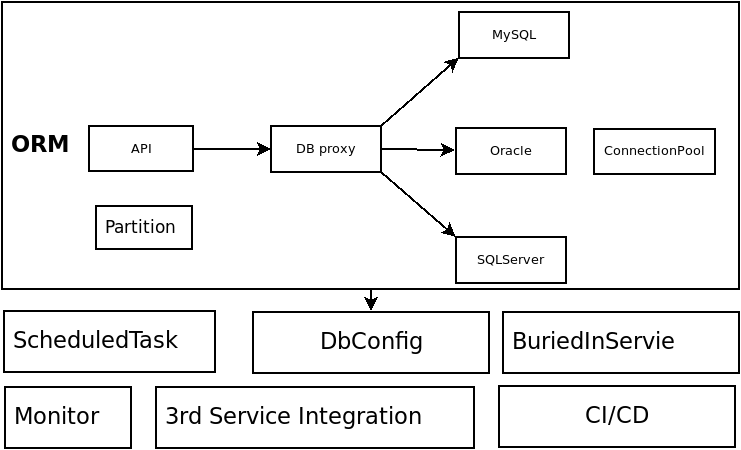
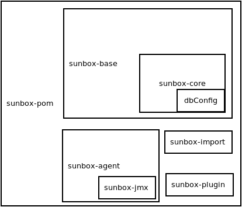

# 1. 简介

 `sunbox` 框架主要用于处理数据密集型的业务，可以将企业的业务从繁杂的数据库操作中解放出来，
 帮助企业极大地提高生产力。

    `sunbox` 框架是领域驱动设计(DDD:Domain-Driven Design)思想的实践，可快速响应互联网行业快速变化的业务需求和版本迭代，使得软件系统更加灵活，同时能够将企业开发人员从繁重的业务开发中解放出来。
 同类型的框架如 `JdonFramework`
## 1.1 功能模块

`sunbox` 框架主要功能如表 1 所示。

表 1 功能模块  

| No | function | Note |
| -- | -- | -- |
| 1 | `ORM` | 数据库的 `CRUD` |
| 2 | 分库分表 | 简单易用的分库分表策略，支持横向扩展 |
| 3 | 埋点 | 可以轻易地在类的方法中进行业务埋点，使业务代码更加优雅 |
| 4 | 定时任务 | 轻松配置定时任务，进行数据的聚合、`ETL` |
| 5 | `CI` , `CD`| 提供简单易用的持续集成、持续部署 |
| 6 | 服务器资源监控 | 提供对服务器硬盘、`CPU` 等资源的监控 |
| 7 | 服务监控 | 提供对服务的监控，灵活的触发机制配置，如短信报警等 |

## 1.2 主要特点
### 1.2.1 灵活性

### 1.2.2 易用性

### 1.2.3 可伸缩性

### 1.2.4 良好的性能

## 1.3 底层
| No | function | Note |
| -- | -- | -- |
| 1 | 数据源封装 | 将 `MySQL`, `SQLServer`, `Oracle`, `SyBase`, `MongoDB`, `SQLServer` 以统一的 `API` 进行封装，提供简单易用的 API 进行调用 |
| 2 | ORM | 提供统一的 ORM API， 隐藏了不同数据源的差异性,简单易用 |
| 3 | 完善的文档 | 提供完善的开发文档，以及最佳实践 Demo |
| 4 |  持续更新升级 | `sunbox` 框架由专业团队维护，跟踪市场变化，满足企业的各种需求 |
| 5 | 技术支持 | 由专业团队提供技术支持 |

# 2. 系统架构
## 2.2 功能模块

## 2.1 架构设计  



## 2.2 项目清单
项目结构如表 2 所示。  
表 2 项目清单  

| No | file/dir | Note |
| -- | -- | -- |
| 1 | pom.xml | pom-parent，配置公共依赖，以及开源项目的版本 |
| 2 | sunbox-agent | 服务监控，如数据库连接数等 |
| 3 | sunbox-api | 领域通用 API |
| 4 | sunbox-base | 框架配置，实现 |
| 5 | sunbox-core | 框架核心实现，`REST API` 领域知识抽象|
| 6| sunbox-import | 自动化部署实现 |
| 7 | sunbox-jmx | agent 实现， 通过 `JMX` 获取 `JVM` 信息 |
| 8 | sunbox-plugins | 第三方服务封装 |
| 9 | sunbox-pom | 是一个父工程，定义了其子工程，可按需打包 |
| 10 | sunbox-sqlmanagement | SQL 语句管理|
| 11 | sunbox-test | 测试 |
| 12 | sunbox-tools | 工具类 |
| 13 | sunbox-web | web 常用的一些静态资源 |
# 3. Best practice
## 3.1 Model
对应数据库中的表结构  

## 3.2 VO  

## 3.3 DBManager  

## 3.4 Scheduled task 


## 3.5 BuriedIn business

埋点业务  

## 3.6 Partition
database, table partition  

对应数据库中的表结构， 例如数据库表结构如下，
```
mysql> desc acct_card_activate;
+------------------+-------------+------+-----+---------+-------+
| Field            | Type        | Null | Key | Default | Extra |
+------------------+-------------+------+-----+---------+-------+
| id               | int(11)     | NO   | PRI | NULL    |       |
| user_id          | varchar(64) | NO   |     | NULL    |       |
| main_card_no     | varchar(50) | NO   |     | NULL    |       |
| card_type        | int(11)     | NO   |     | NULL    |       |
| custom_name      | varchar(50) | YES  |     | NULL    |       |
| custom_phone     | varchar(50) | YES  |     | NULL    |       |
+------------------+-------------+------+-----+---------+-------+
14 rows in set (0.04 sec)
mysql>
```
对应的 Model 如下
```
public class AcctCardActivateModel {
    private Integer id;
    private  String userId;
    private  String mainCardNo;
    private  Integer cardType;
    private  String customName;
    private  String customPhone;
}
```
## 3.2 VO
## 3.3 DBManager
## 3.4 Scheduled task
## 3.5 埋点
## 3.6 分库分表
# 4. mvn package
```
cd {WORKSPACE_DIR}  
git pull xxxxxx  
sudo echo 'SUNBOX_ROOT={WORKSPACE_DIR}' >> /etc/profile  
source /etc/profile  
cd {WORKSPACE_DIR}/sunbox-pom/  
mvn clean compile package -Dsunbox-group-version=1.0
```
这样 所有的包已经安装在自己的本地 `maven` 仓 `～/.m2.repository` le ,可以开始开发工作了
